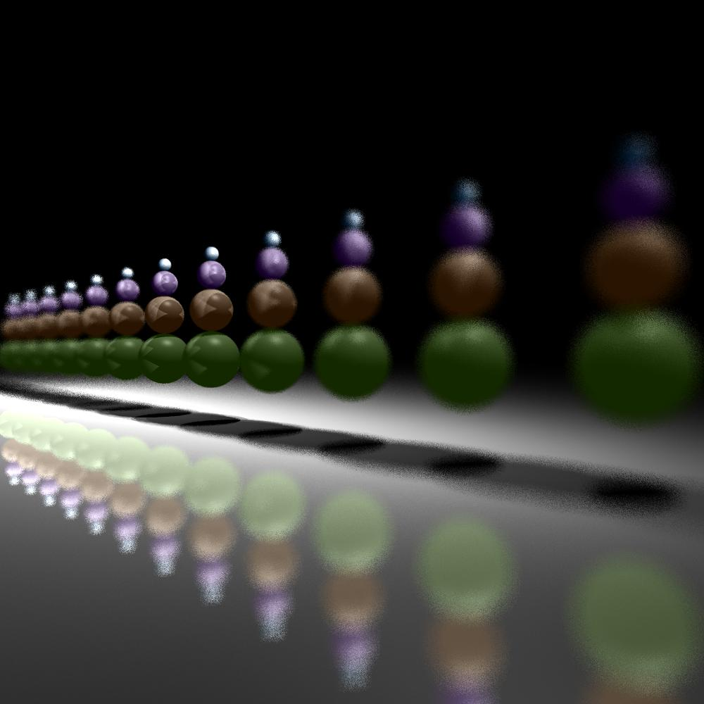
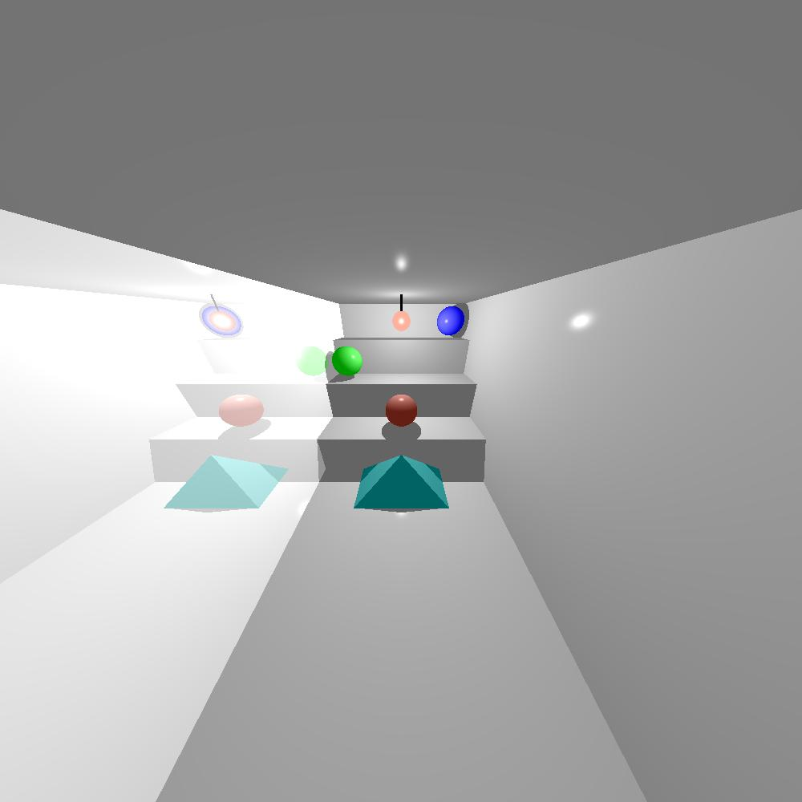

# Ray Tracer
Project in Introduction to Software Engineering course at JCT
My partner for this project is @BaruchBichman  

## Description  
The project is a library that can model shapes, lighting and shade by using linear algebra with emphasis on design pattern and writing tests

### Examples

Mirror and focus effects
